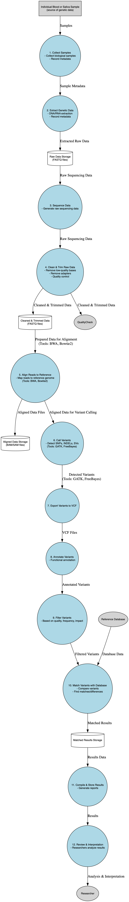

# Welcome to the Genetic Data Processing Pipeline Documentation

This documentation provides an overview and detailed description of the steps involved in processing genetic data from biological samples to final results. The pipeline includes sample collection, data extraction, sequencing, data cleaning, alignment, variant calling, annotation, filtering, matching, and interpretation.

Use the navigation menu to explore each section in detail.
